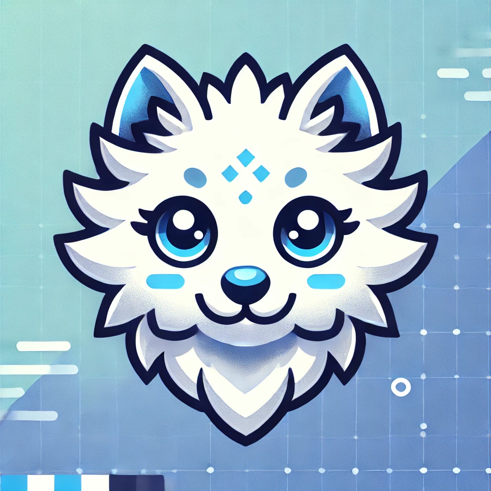

  

    
    

      <h1 style="color: white; font-size: 3rem; text-shadow: 2px 2px 4px #000000;">Welcome Visitor</h1>
      
To a Wonderful World of Code and Creativity

    

  

## About Me

I am a passionate software engineer with experience in various programming languages and technologies.
Always looking to learn and grow and building some fun projects.
I am excited to share my journey with you.

## Skills

Some of my skills I enjoy using to build projects:

  

## Projects

Some of my ongoing projects:

  
  <a href="https://github.com/FinnyChSt/simple-ai-chat">Simple-ai-chat</a>: A Simple Chat to interact with AI locally on your machine in a Docker environment.

    
    <a href="https://github.com/FiSeStRo/Ecoland-Backend-Service">Ecoland</a>: Bringing an old browser game back to life with a modern touch.

## Connect with Me

Let's stay in touch! You can find me on LinkedIn or send me an email:

  
  &nbsp;&nbsp;
  

  

    
    

      <h1 style="color: white; font-size: 3rem; text-shadow: 2px 2px 4px #000000;">Thank You For Visiting!</h1>
  

